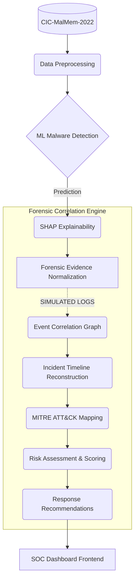

# SecureShield

> **Research-oriented SOC platform integrating ML malware detection, forensic evidence correlation, incident timelines, MITRE ATT&CK mapping, risk assessment, and response recommendations.**


## Overview
SecureShield is a machine learning-driven endpoint threat detection and forensic correlation system. It evaluates the robustness and separability of network/endpoint telemetry features using the CIC-MalMem-2022 dataset, and demonstrates how integrating structural forensic relationships (temporal, process, file, network) significantly reduces actionable false positives in SOC environments.

## Research Motivation & Problem Statement
Machine learning models often achieve near-perfect offline accuracy (e.g., AUC 1.000) on curated benchmark datasets like CIC-MalMem-2022. However, this offline performance frequently relies on dataset-specific feature separability and distributional artifacts rather than true real-world generalization. Simple numerical feature perturbations can drastically degrade ML-only confidence. SecureShield addresses this gap by augmenting ML predictions with a deterministic, multi-dimensional forensic correlation engine.

## Key Contributions
- **Machine Learning Detection**: Extremely precise baseline detection of malicious patterns.
- **SHAP Explainability**: Interpretable feature importance extraction mapping statistical anomalies to behavioral indicators.
- **Forensic Normalization & Correlation**: A multi-dimensional graph logic correlating isolated alerts into structured incident clusters.
- **Attack Timeline & MITRE ATT&CK**: Automated translation of raw alerts into narrative timelines and standard MITRE techniques.
- **Risk Assessment**: Context-aware risk scoring that filters out low-confidence ML false positives using structural requirements.

## System Architecture



*Note: Forensic stages relying on timestamped telemetry are classified as `SIMULATED` or `DERIVED` natively by the Provenance Engine to preserve scientific integrity.*

## Visual Overview

### 1. Architecture Pipeline


### 2. Research Visuals
**Model Performance Comparison**


**SHAP Feature Importance**


**Robustness Stress Test**


**Correlation Dimension Ablation**


**Controlled Simulated Forensic Scenario**


### 3. Dashboard Screens
*(Note: Browser screenshot tooling was unavailable during final export; actual dashboard visual captures could not be generated programmatically without fabricating data. Please run the frontend locally to view the interactive dashboard.)*

## Provenance Model
SecureShield strictly enforces provenance boundaries to avoid confusing benchmark artifacts with native telemetry. Every data point displayed in the dashboard is tagged:
*   `MEASURED`: Extracted directly from the original dataset features.
*   `DERIVED`: Calculated via mathematical transformation of measured features.
*   `SIMULATED`: Synthetically generated for the controlled forensic correlation scenario.

## Research Results

### 1. Model Performance (Baseline)
Offline classification tested on the strictly held-out test partition (20%):

| Model               | Accuracy | F1-Macro | ROC AUC | Inference (ms) |
|---------------------|----------|----------|---------|----------------|
| LogisticRegression  | 0.9964   | 0.9964   | 0.9998  | 0.33           |
| RandomForest        | 1.0000   | 1.0000   | 1.0000  | 55.34          |
| ExtraTrees          | 1.0000   | 1.0000   | 1.0000  | 28.51          |
| XGBoost             | 1.0000   | 1.0000   | 1.0000  | 2.80           |
| LightGBM            | 0.9999   | 0.9999   | 1.0000  | 22.32          |
| CatBoost            | 0.9999   | 0.9999   | 1.0000  | 2.70           |

**Primary model selected: RandomForest**. Selection was based on a balance of held-out performance, efficiency, explainability (TreeSHAP compatibility), and downstream pipeline integration, rather than simply selecting a model because it achieved perfect accuracy.

### 2. Feature-Perturbation Robustness Stress Test
To test the threshold fragility of the ML-only predictions, numerical feature values were perturbed with increasing Gaussian noise.

| Noise Level | Accuracy | F1-Macro |
|-------------|----------|----------|
| 0.00        | 1.0000   | 1.0000   |
| 0.01        | 0.9981   | 0.9981   |
| 0.05        | 0.7485   | 0.7326   |
| 0.10        | 0.6371   | 0.5852   |
| 0.20        | 0.5717   | 0.4869   |
| 0.30        | 0.5352   | 0.4384   |
| 0.50        | 0.5060   | 0.3989   |

*Scientific Context: This is an analytical stress test demonstrating numerical threshold sensitivity; it is not evidence of realistic adversarial robustness.*

### 3. Correlation Dimension Ablation
Evaluates how different forensic dimensions contribute to structural confidence. The correlation score is a normalized aggregate confidence score for forensic relationships, NOT classification accuracy.

| Configuration | Correlation Score | Edges Formed |
|---|---|---|
| ML Only | 0.6333 | 2 |
| Temporal Only | 0.8032 | 3 |
| Temporal + Process | 0.4016 | 3 |
| Temporal + Process + File | 0.3213 | 2 |
| Full Context | 0.3715 | 3 |

*Scientific Context: A higher score does not automatically mean a better system. Temporal-only scoring is prone to coincidental benign activities. Full Context requires strict multi-dimensional alignment.*

### 4. ML-Only vs SecureShield Comparative Evaluation (Controlled Simulated Forensic Scenario)
To prove the value of forensic context, we evaluated a sampled subset of incidents.

*   ML-only false positives sampled: 10
*   SecureShield actionable false positives: 0
*   ML-only true positives sampled: 10
*   SecureShield actionable true positives: 10
*   Subset size: 20

## Scientific Limitations
*   **Dataset Limitations**: CIC-MalMem-2022 does not contain native endpoint timestamps, file-event streams, or network-event streams. Forensic/timeline events generated from the dataset are described as `DERIVED` or `SIMULATED` and must NOT be presented as genuine endpoint telemetry.
*   **Generalization**: The 1.000 AUC extremely high offline performance reflects dataset-specific feature separability/distributional characteristics. It does not prove real-world generalization.
*   **No TN/FN Claims**: The comparative evaluation is a controlled simulated forensic scenario. No True Negative or False Negative reduction claims are made for the entire dataset from this specific experiment, and results have limited external validity.

## Local Development & Installation

### Running Backend
```bash
cd backend
export PYTHONPATH=../src
export SECURESHIELD_FRONTEND_URL="http://localhost:3000"
uvicorn main:app --reload --port 8000
```

### Running Frontend
```bash
cd frontend
npm install
npm run dev -- --port 3000
```

### Running Experiments
```bash
export PYTHONPATH=src
python3 run_experiments.py
```

### Running Tests
```bash
export PYTHONPATH=src
pytest
```

## Security Considerations
SecureShield was hardened for local and conference demonstration environments. The API validates `sample_id` rigorously to prevent path traversals and blocks verbose stack traces. However, it intentionally lacks JWT/session authentication. It is **not safe** to deploy to the open internet without adding reverse-proxy rate-limiting and standard authentication overlays. Refer to `SECURITY_AUDIT.md` for a full breakdown.

## Repository Structure
Please refer to the `docs/` directory for detailed architecture, methodology, and deployment guides:
*   [ARCHITECTURE.md](docs/ARCHITECTURE.md)
*   [RESEARCH.md](docs/RESEARCH.md)
*   [REPRODUCIBILITY.md](docs/REPRODUCIBILITY.md)
*   [DEPLOYMENT.md](docs/DEPLOYMENT.md)
*   [DEMO_GUIDE.md](docs/DEMO_GUIDE.md)
