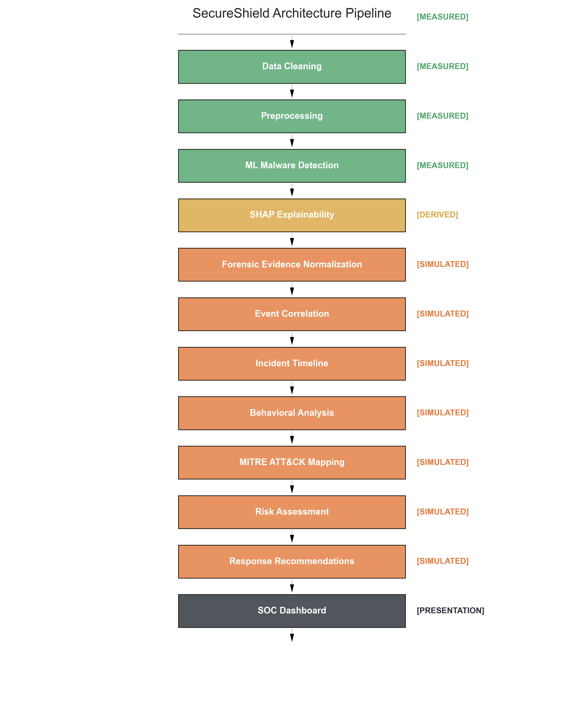
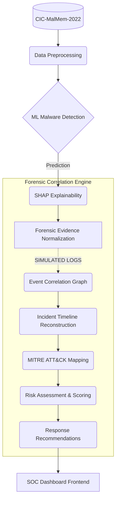
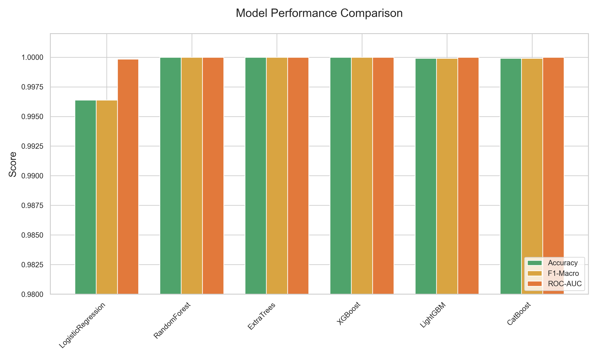
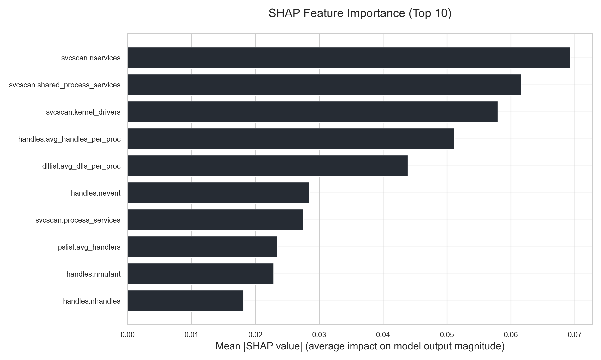
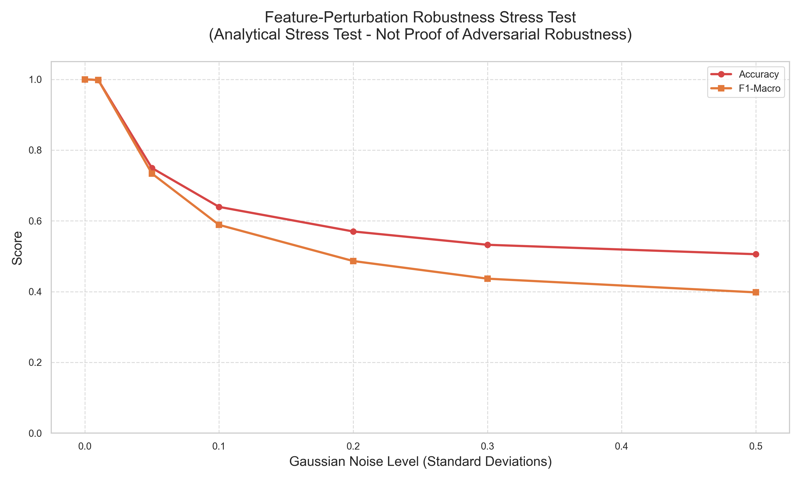
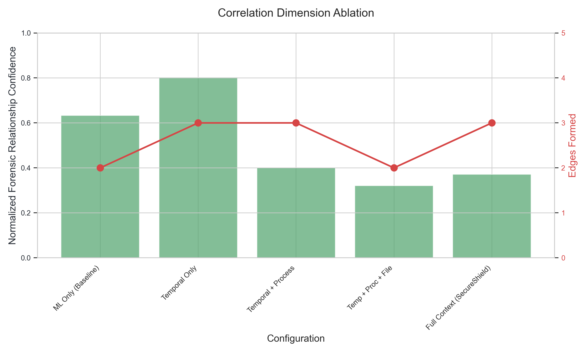
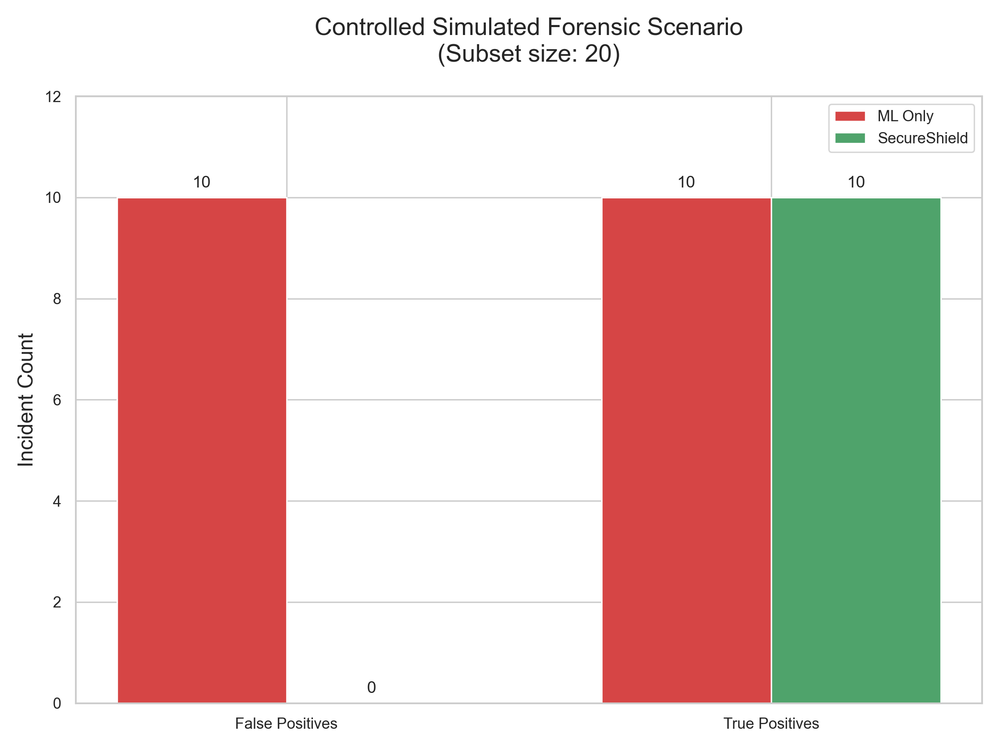

# SecureShield

> **Research-oriented SOC platform integrating ML malware detection, forensic evidence correlation, incident timelines, MITRE ATT&CK mapping, risk assessment, and response recommendations.**


---

## Overview

SecureShield is an evidence-aware Security Operations Center (SOC) analytics platform that bridges the gap between raw machine learning (ML) classification and structural forensic reality.

The core pipeline evaluates incoming endpoints by combining:

`ML Malware Detection` → `SHAP Explainability` → `Forensic Evidence Normalization` → `Event Correlation` → `Incident Timeline Reconstruction` → `Behavioral Analysis` → `MITRE ATT&CK` → `Risk Assessment` → `Response Recommendations`

*Note: SecureShield is a research prototype designed to evaluate correlation logic against ML classification boundaries. It is not a commercial SOC product.*

---

## Why SecureShield?

Traditional ML malware classifiers can produce an accurate binary prediction (Malicious vs. Benign) but do not inherently explain:
*   What evidence supports the decision?
*   How do isolated observations relate to one another?
*   How did the incident unfold chronologically?
*   Which MITRE ATT&CK behaviors are implicated?
*   What specific response should follow?

SecureShield addresses this by augmenting offline numerical ML predictions with a deterministic, multi-dimensional forensic correlation engine. By requiring structural evidence to confirm statistical anomalies, SecureShield acts as a noise-reduction filter against ML false positives.

---

## Key Contributions

1.  **ML Malware Detection**: Precision baseline detection using ensemble methods.
2.  **SHAP-based Explainability**: Interpretable feature extraction mapping statistical anomalies to indicators.
3.  **Forensic Evidence Normalization**: Simulated extraction of structural graphs from numerical metrics.
4.  **Multi-dimensional Event Correlation**: Temporal, Process, File, and Network graph formation.
5.  **Incident Timeline Reconstruction**: Narrative reconstruction of attack stages.
6.  **Evidence-constrained MITRE ATT&CK Mapping**: Hard mapping of TTPS based solely on established evidence.
7.  **Quantitative Risk Assessment**: Context-aware triage scoring.
8.  **Response Playbook Generation**: Automated remediation instructions.
9.  **Research Ablation and Robustness Experiments**: Demonstrating the fragility of ML thresholds.
10. **Provenance-aware Architecture**: Strict tagging of real vs. simulated data.

---

## System Architecture





*Note: Forensic stages relying on timestamped telemetry are classified as `SIMULATED` or `DERIVED` natively by the Provenance Engine to preserve scientific integrity.*

---

## End-to-End Workflow

`Dataset` → `Preprocessing` → `ML Detection` → `SHAP` → `Forensic Normalization` → `Event Correlation` → `Timeline` → `Behavioral Analysis` → `MITRE ATT&CK` → `Risk` → `Response` → `SOC Dashboard`

---

## Research Foundation

**Dataset: CIC-MalMem-2022 Binary Classification**
*   **Original Records**: 58,596
*   **Benign**: 29,298
*   **Malware**: 29,298
*   **Exact Duplicate Rows Removed**: 569
*   **Final Records**: 58,027
*   **Original Features**: 52 Volatility-extracted numerical features
*   **Selected Features**: 14 subset features optimized for separation
*   **Split**: 80/20 deterministic stratified split

*SecureShield does not claim the CIC-MalMem-2022 dataset contains native endpoint timelines or network telemetry.*

---

## Model Evaluation

Offline classification tested on the strictly held-out test partition (20%):

| Model | Accuracy | F1-Macro | ROC-AUC | Inference (ms) |
| :--- | :--- | :--- | :--- | :--- |
| LogisticRegression | 0.9964 | 0.9964 | 0.9998 | 0.33 |
| **RandomForest** | **1.0000** | **1.0000** | **1.0000** | **55.34** |
| ExtraTrees | 1.0000 | 1.0000 | 1.0000 | 28.51 |
| XGBoost | 1.0000 | 1.0000 | 1.0000 | 2.80 |
| LightGBM | 0.9999 | 0.9999 | 1.0000 | 22.32 |
| CatBoost | 0.9999 | 0.9999 | 1.0000 | 2.70 |



**RandomForest** was chosen as the primary model to balance explainability (TreeSHAP compatibility), integration stability, and baseline capability. The perfect test accuracy is an artifact of dataset separability, not an indicator of real-world supremacy.

---

## Explainability

SHAP (SHapley Additive exPlanations) is utilized to determine exactly which dataset features influenced the numerical classification.



Features such as `svcscan.nservices` dominate the classification output. This indicates **dataset-specific feature separability / distributional characteristics associated with the CIC-MalMem-2022 collection methodology**, underscoring why structural correlation is required in real environments.

---

## Feature-Perturbation Robustness Stress Test

To test the fragility of the ML-only predictions, numerical feature values were perturbed with increasing Gaussian noise.



*Scientific Context: This is an analytical stress test demonstrating numerical threshold sensitivity; it is NOT proof of realistic adversarial robustness.*

---

## Correlation Ablation

Evaluates how different forensic dimensions contribute to structural confidence. 



The normalized forensic relationship confidence score is **NOT** classification accuracy. A higher score does not automatically mean a better system (e.g., Temporal Only produces a high score but is prone to coincidental benign activities).

---

## Controlled Simulated Forensic Scenario

To prove the value of structural forensic context, we evaluated a sampled subset of incidents using SecureShield's logic filter:



*   **ML-only FP sampled**: 10
*   **SecureShield actionable FP**: 0
*   **ML-only TP sampled**: 10
*   **SecureShield actionable TP**: 10
*   **Subset size**: 20

*Note: This is a controlled simulated evaluation because CIC-MalMem-2022 does not provide native endpoint event streams. This result cannot be generalized to the entire dataset.*

---

## Provenance Model

| Provenance | Meaning |
| :--- | :--- |
| **MEASURED** | Directly measured from available data/system (e.g., CIC-MalMem-2022 values) |
| **DERIVED** | Computed from existing evidence (e.g., SHAP values, base probabilities) |
| **SIMULATED** | Controlled/generated for evaluation (e.g., timestamps, simulated structural events) |

This distinction is central to SecureShield’s scientific integrity, preventing the presentation of simulated research scenarios as native collected telemetry.

---

## Dashboard

*(Note: Browser screenshot tooling was unavailable during final export; actual dashboard visual captures could not be generated programmatically. Please run the frontend locally to view the interactive dashboard.)*

The dashboard features the following interactive panes:
- Dashboard Overview
- Malware Analysis
- Forensic Evidence
- Timeline
- Incident Graph
- MITRE ATT&CK
- Risk & Response
- Research Results

---

## Technology Stack

| Domain | Technologies |
| :--- | :--- |
| **Backend** | Python, FastAPI, Pydantic, scikit-learn, XGBoost, LightGBM, CatBoost, SHAP, NetworkX |
| **Frontend** | React, TypeScript, Vite, Tailwind CSS v4, React Flow, Recharts, Lucide |
| **Testing / Reproducibility** | pytest, npm audit, deterministic random seeds |

---

## Repository Structure

```text
secure-shield/
├── backend/                  # FastAPI Application
├── frontend/                 # React UI Dashboard
├── src/secureshield/         # Core Research Pipeline
│   ├── detection/            # ML Classification
│   ├── explainability/       # SHAP implementations
│   ├── forensics/            # Simulated Log Generators
│   ├── correlation/          # NetworkX Graph Logic
│   ├── timeline/             # Temporal Reconstruction
│   ├── mitre/                # ATT&CK Mapping Rules
│   ├── risk/                 # Triage Scoring
│   └── response/             # Playbook Generation
├── experiments/              # Validated Results & Tables
├── configs/                  # Hyperparameters & Settings
├── tests/                    # Provenance & Pipeline Tests
├── scripts/                  # Visual & Data Generators
├── docs/                     # Extended Documentation
└── README.md
```

---

## Quick Start

```bash
git clone https://github.com/CHAITHANYAHEGDE/SecureShield.git
cd SecureShield

# 1. Pipeline & Backend Setup
python3 -m venv venv
source venv/bin/activate
pip install .
export PYTHONPATH=src
export SECURESHIELD_FRONTEND_URL="http://localhost:3000"
cd backend
uvicorn main:app --reload --port 8000

# 2. Frontend Setup (In a new terminal)
cd frontend
npm install
npm run dev -- --port 3000
```

---

## Reproduce the Research

See [docs/RESEARCH.md](docs/RESEARCH.md) and [docs/REPRODUCIBILITY.md](docs/REPRODUCIBILITY.md) for deeper details. 

```bash
# Execute the full deterministic research pipeline
export PYTHONPATH=src
python3 run_experiments.py
```
Read the formal validation report here: [RESEARCH_VALIDATION_REPORT.md](RESEARCH_VALIDATION_REPORT.md).

---

## Security

See [SECURITY_AUDIT.md](SECURITY_AUDIT.md).

Current application scope is **local/conference/demo oriented**. Public internet deployment requires additional authentication (JWT/OAuth) and abuse protection (Redis Rate Limiting). Do not expose the API openly without an API gateway.

---

## Deployment

See [docs/DEPLOYMENT.md](docs/DEPLOYMENT.md).

Configurations are provided for cloud services (Render, Vercel), but the architecture fundamentally distinguishes between:
*   **LOCAL**: Fully supported.
*   **CONFERENCE**: Supported via protected network.
*   **PUBLIC INTERNET**: Unsafe without adding authentication.

---

## Scientific Limitations

1.  **CIC-MalMem-2022 lacks native endpoint timestamps/file/network streams.**
2.  **Forensic/timeline events are derived/simulated where applicable.**
3.  **Controlled forensic evaluation has limited external validity.**
4.  **Feature perturbation is an analytical stress test.**
5.  **Very high offline performance does not establish real-world generalization.**
6.  **Dataset-specific feature separability may not transfer to other datasets/environments.**

---

## Future Work

*   Real endpoint telemetry ingestion via Elastic/Splunk APIs.
*   Live event stream processing.
*   Broader external dataset evaluations (e.g., custom detonations).
*   Calibrated risk models utilizing Bayesian logic.
*   Authentication and multi-user deployment structures.
*   Rate limiting / abuse protection implementation.
*   Expanded MITRE ATT&CK technique coverage.
